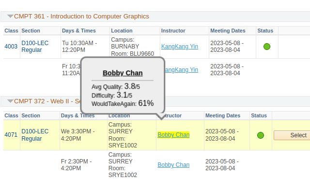
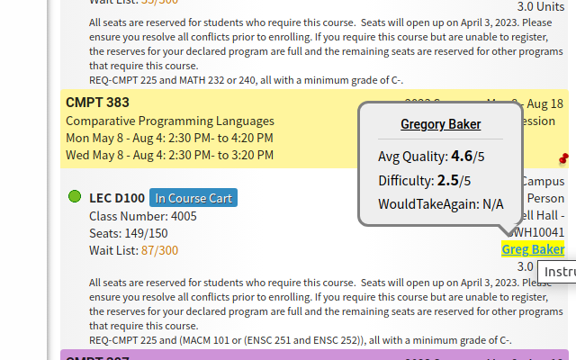

  <h2>SFU Chrome Extension</h2>
  

 

Chrome extension for SFU students to easily access prof rating from RateMyProfessor.com on SFU course registration pages (goSFU, mySchedule). 

First, the extension will create a loading page for collecting SFU course offerings and RMP rating info. This job may take a few minutes depending on your network availablity. Please do not close the window until the processing completes.  

After then, it will start to show professor rating in a tooltip on every professor name on goSFU and mySchedule. Hover your mouse on the highlighted professor names, then you'll find the abbreviated RMP rating info.  

The extension runs updates for every new semester automatically.  

  
  

## Running in Development Mode    
1. Clone or download the repository.  
2. Enter the extension setting page and enable **Developer Mode**  
3. Click the top left **Load unpacked** button and select the repository directory.  
  
## Running Test  
    

    

    
  
1. `npm install` to install dev dependencies  
2. `npm test` to run all test suites  

