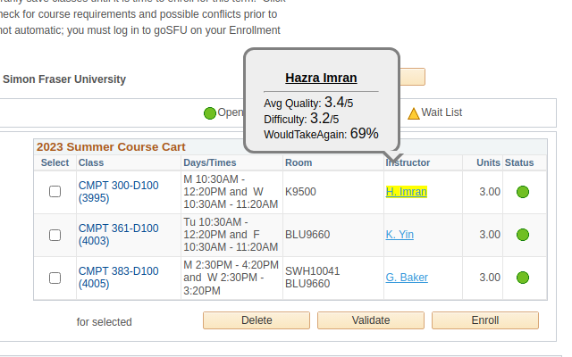

  <h2>SFU Chrome Extension</h2>
  

 

A Chrome extension for SFU students to easily access professor rating info from RateMyProfessor.com directly on SFU course registration pages (goSFU, mySchedule).  

Once you install the extension, it will opens a loading tab to collect SFU course listing and RMP rating info. This job may take a few minutes depending on your network availablity. Please do not close the window until the processing completes.  

The extension will show the professor ratings on every professor name on goSFU and mySchedule. Hover your mouse on the highlighted professor names, then it will create a tooltip filled with professor name and rating.  

The extension automatically runs updates for every new semester.  

  
  
  

## Running in Development Mode    
1. Clone or download the repository.  
2. Enter the extension setting page and enable **Developer Mode**  
3. Click the top left **Load unpacked** button and select the repository directory.  
  
## Running Test  
    

    

    
  
1. `npm install` to install dev dependencies  
2. `npm test` to run all test suites  

